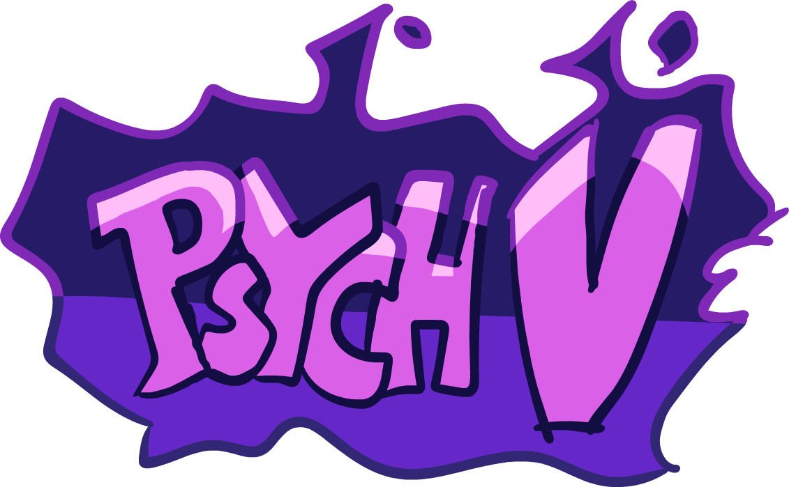

Psych engine but it's back!

Yeah that's it.

## Installation:

Initial Setup here: [DEPENDENCIES.md](/docs/DEPENDENCIES.md).

You'll wanna do `haxelib --global install hmm`, `haxelib --global run hmm setup`, then finally you run `hmm install` to install all the required libraries.

Run `haxelib run lime setup` if you don't already have lime setup

And then run `lime test <platform>` or `lime test <platform> -debug`

And you should be good :D

## Customization:

If you wish to disable things like **Lua Scripts** or **Video Cutscenes**, you can refer to the `Project.xml` file.

Inside `Project.xml`, you will find several variables to customize Psych Engine to your liking.

To start you off, disabling **Video Cutscenes** should be simple, simply delete the line `"VIDEOS_ALLOWED"` or comment it out by wrapping the line in XML-like comments, like this: `<!-- YOUR_LINE_HERE -->`

Same goes for **Lua Scripts**, comment out or delete the line with `LUA_ALLOWED`, this and other customization options are all available within the `Project.xml` file.

## Softcoding (.lua/.hx)

For this you can head over to [the Psych Engine Lua wiki](https://shadowmario.github.io/psychengine.lua)!
There you can learn how to use the base 212 PlayState Lua funcions in your mod!

And then for PsychV there will be a file in here that acts as the wiki for here once there are changes.

## Credits:

- Maki - Main Programmer and Head of PsychV

# Features

The features are the same as Psych Engine but there are the following changes:

- None lol

#### PsychV Engine by Maki, Psych Engine by ShadowMario, Friday Night Funkin' by ninjamuffin99
